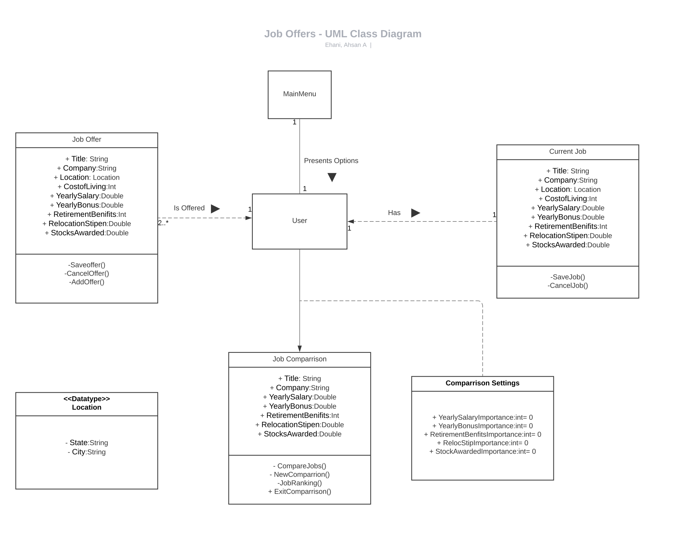
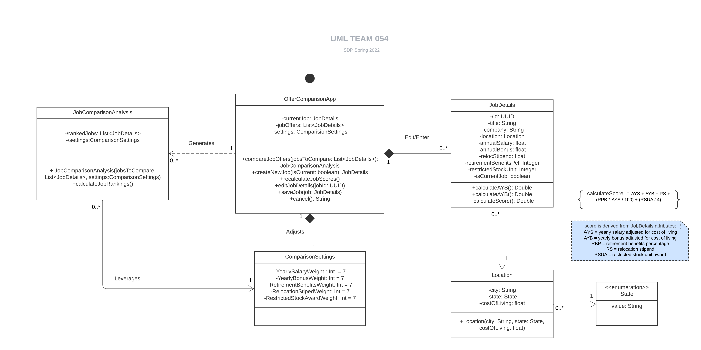

# Group Project Deliverable 1, CS6300, Spring 2022
#### nkumar323@gatech.edu, bschmid3@gatech.edu, jsullivan73@gatech.edu, aehani3@gatech.edu

## 1. Individual Design Critiques

#### 1.1 Design 1

##### Pros:
 * The design is very detailed and show cases all the attributes as described in the requirement document.
 * Location class is a separate class which is very well thought. It can also contain Cost of Living.
 
##### Cons:
 * No superclass/Interface shown in the design.
 * No indication for Entry point for the app
 * User class may not be needed since the app starts with a menu with multiple options.
 
 

#### 1.2 Design 2

##### Pros: 
* Simplicity of design
* Class methods are well defined with parameters needed to invoke them.
* OfferComparisonApp class is the singleton entry point for the app -  shown in design.
* None to many mapping for the classes.

##### Cons:
* Missing Location class.
* Restrictions on weight assignment for ComparisonSettings. User cannot allocate any weight more than 7.

#### 1.3 Design 3

##### Pros:
* Separate Location and State classes showing their relationship.
* Location class shows costOfLiving.
* Good indication for read-only job rankings.
* NewCompare Option matching the requirements.
* CompareSettings allows user to reset the settings.

##### Cons:
* Current and Current Job Details classes are not very clear
* No multiple mapping for Job Offer and mainMenu.
* adjustCostOfLiving may belong to the Location class.
* State representation can be updated as an Enum.

#### 1.4 Design 4

##### Pro:
* Very detailed design, covers most of the points from requirements.
* JobDetails uses Id attribute for saving/editing job details, this helps to avoid duplication.
* Rank calculation formula (constraint definition) in design is shown.

##### Cons:
* No separate location class
* In stead of a method, use setters for setting weights in comparisonSettings class
* The formula can show case the weights used for rank calculation.
* Compare Offers class doesn't contain Rank since it uses "Job" and thus doesn't cover all the requirements.

## 2. Team Design
### UML Class Diagram

#### 2.1 Commonalities & Differences
For our team design, we chose to start with [Brittnay's Design #2](#12-design-2), since it seemed to most closely represent the app start up menu. Below are some common points between our team design and individual design:
* Each of our individual designs represented some form of a "JobDetails" class.
* Each of our designs also thought of the app entry point to be a singleton class. Although, the naming conventions we each chose for this class were different, like "OfferComparisonApp", "User" and "MainMenu".
* Some individual designs represented a separate `Location` class while others kept that information in `JobDetails`. In our team meeting, we decided to go with a separate `Location` class used by Job Details. This class contains the costOfLiving index and can be available for all other classes. This was first shown in [Adam's design #3](#13-design-3).
* We also agreed to leverage the class and constraint details from [Niraj's design #4](#14-design-4). We added the detailed method signature from [Design #2](#12-design-2) and used it in our final team design.

#### 2.2 Design Decisions Justifications
* We decided to go with the approach of having the entry point for the app be a singleton class, since the requirements suggested having only one app instance running for a user. This class, `OfferComparisonApp`, stores information about the user's current job, maintains the list of `JobDetails` and the `OfferComparisonSettings` and generates a `JobComparisonAnalysis` on demand.
* The multiplicity notations in the UML help describe the class associations. The design also represents composition relationships and emphasizes the dependence of the contained class on container class.
* The `JobComparisonSettings` attribute values default to 7, so that when they are considered in the score calculation, they will start off as 1 (7/7) and can be adjusted from there. The score for each `JobDetails` instance will be calculate whenever a `JobComparisonAnalysis` is generated via the `OfferComparisonApp`.recalculateJobScores() method, which will trigger the `JoDetails`.calculateScore() method for each instance. We also decided to show the constraints for calculating the score in the UML for further clarification.
* Also, to keep the design cohesive, a `Location` class was separated out from the `JobDetails` and contains location specific attributes.
* We made `State` an enumeration, since it consists of known and set string values.
* We also decided to show the read-only/derived attributes of a class by marking them with `/`.

## 3 Summary
Our team did a great job working together and contributing to design process.
* We immediately created a private communication channel using Microsoft Teams that allowed for asynchronous conversation and "threaded" discussion.
* We coordinated a meeting to discussion the individual and team designs.
* We made a big progress for the deliverable using individual git commits and discussion in MS Teams.
* We also collaborated remotely on a shared LucidChart UML diagram and discussed design and implementation ideas in Teams while simultaneously working on the design.

### Lessson's Learned
* To ensure that we are all on the same page, it is critical to obtain comments and opinions from each team member on crucial design decisions.
* Getting each team member's thought process while creating their own design helped a lot in understanding the idea behind the design and helped clear other's doubts.
* It was valuable for us to agree on what the design language (UML) meant in the context of the team design we created, so that we could all be on the same page.
* Each person brought a unique perspective to the design, which enabled us to create a more effective team design overall.