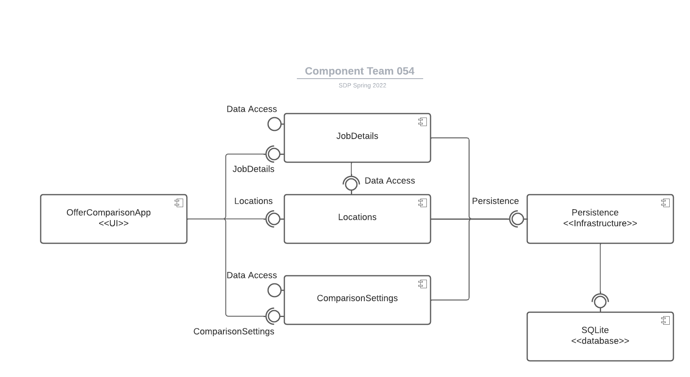
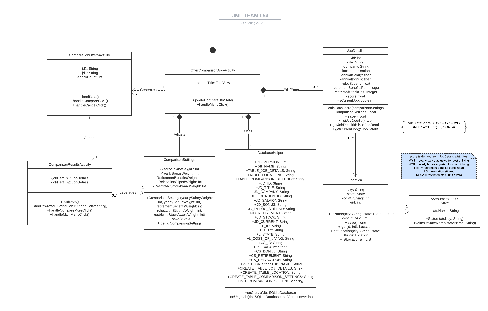
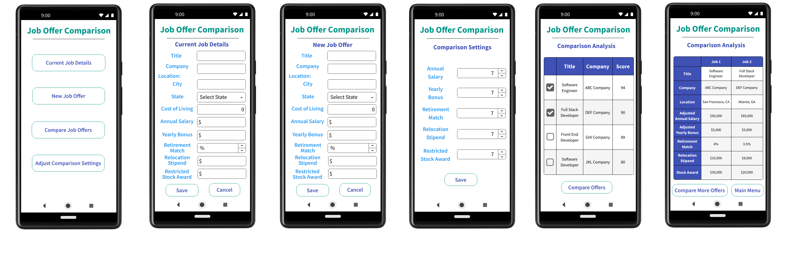

# Design Document

**Author**: Group 54

## 1 Design Considerations

### 1.1 Assumptions

Below assumptions were made while working on this design, any change in these conditions will require significant changes to the design:

- The app will be designed, implemented and tested using Android emulators and Android mobile phones.
- Offer Comparison Application only supports the English language, so users will not be able to update the language used in the app.
- The application allows the user to save a new job, edit an existing job and compare between multiple job offers.
- There are some read-only attributes which are derived using other core attributes of the Job Details and are used for the comparison algorithm.
- There will not be any tutorial/user-manual made available to the user. The self-explanatory menu options will guide the user to perform the job comparisons. However, the user can refer to the design documentation for additional information.
- The app will not require an Internet connection to operate.
- The application state is persisted between runs. This will be achieved by leveraging Android SQLite, which is included into Android SDK package and is supported by the Android Operating System. All essential database updates will be done by the app in background.

### 1.2 Constraints

* The minimum API level supported by the app is “API 29: Android 10.0 (Q)”
* The application language cannot be changed for more usability.
* The app should not depend on any existing databases configuration on device. It should create and maintain its own data tables when installed/uninstalled.
* The app will be specifically designed and implemented to work on Android mobile phones, so the operation and appearance on other devices is not guaranteed.
* There is no login system for its users, so all job information entered will be available to anyone who accesses the system.
* The screen is designed for "portrait" mode only. There is no plan to support responsiveness when in "landscape" orientation.

### 1.3 System Environment

#### 1.3.1 Hardware

The application will run on Android mobile phones having a screen size of 6.3 inches, 537 ppi and require minimum 4GB RAM (e.g. Pixel 4XL).

#### 1.3.2 Software

The Java-based application will run on Android OS with API level 29, Android 10 (Q) with no pre-installed packages.
The inbuilt SQLite database will be used for persisting the app's state.

## 2 Architectural Design

### 2.1 Component Diagram

### 2.2 Deployment Diagram

A formal deployment diagram is not necessary, because this is a simple system that is deployed on an android mobile phone, a single hardware device. The software components will be deployed on the android mobile phone which includes: Android SQLite and Android SDK packages.

## 3 Low-Level Design

OfferComparisonApp will be the main user interface for the app. It will be responsible for capturing requests from the user to create and modify various JobDetails, Locations, and the ComparisonSettings and forwarding those requests to the SQLite database. The SQLite DB will be queried to return the results to the user via the OfferComparisonApp interface.

### 3.1 Class Diagram

## 4 User Interface Design

