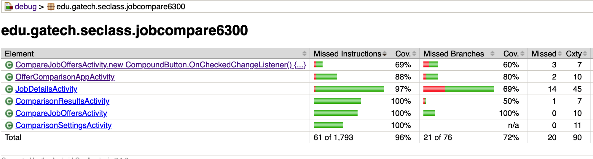

# Test Plan

<!-- *This is the template for your test plan. The parts in italics are concise explanations of what should go in the corresponding sections and should not appear in the final document.* -->

**Author**: Group 54

## 1 Testing Strategy

### 1.1 Overall strategy
The strategy implemented for the following test are structured at each milestone through self-design testing utilizing JUnit.

#### 1.1.1 Unit Testing
Developers will test each individual testable portion without combining units, instead isolating each written block of code and testing it with various test cases using Junit. This enables the early detection of bugs in the application development process. This is the initial milestone to complete. In this phase, we will focus on getting high level of line/function coverage in IDE for each class/activity.

#### 1.1.2 Integration Testing
Testers create multiple test cases that utilize combined units to validate and ensure the functionality of units integrated together are providing the correct results as per the requirement specifications. This is the second milestone to complete.

#### 1.1.3 System Testing
Testers and QA(Quality assurance) test the system specification at full length as a whole in which all units are integrated into combined whole parts. This allows for checking the component interaction with different inputs. The bugs found are logged in Github issues and assigned to the appropriate developer for fixing. This is the third milestone to complete.

#### 1.1.4 Regression Testing
Developers test the application after updates and/or changes to system. This allows for safeguarding the applications from ineffective changes or updates. The bugs found are logged in Github issues and assigned to the appropriate team-member for fixing. This is the final milestone to complete.

### 1.2 Test Selection
Testers will use white-box testing techniques. Testers will start with control flow testing. If time permits testers will add branch testing to add additional coverage.

### 1.3 Adequacy Criterion
To assess the control flow stage of testing, testers will use Android Studio internal tools to determine code coverage. The goal for code coverage is **80%-90%**. 

If branch testing is preformed, branch diagrams will be created for methods in each class. These diagrams will help determine the total number of branches and the number of executed branches. We can then divide executed branches by total branches to help determine branch coverage.

The instrumented test coverage report from IDE is shown below:

### 1.4 Bug Tracking
Bugs shall be tracked continuously throughout the development of the application and each component by developers. All bugs will be tracked and assigned using the [Github issues](https://github.gatech.edu/gt-omscs-se-2022spring/6300Spring22Team054/issues) for the project repository. After each bug is found, re-testing at each level of milestone will be completed again until bugs are resolved.

### 1.5 Technology
Developers and tester will work together and use Junit to create test cases for each testing milestone to validate and check for defective source code and bugs in the application.

## 2 Test Cases

<!-- *This section should be the core of this document. You should provide a table of test cases, one per row. For each test case, the table should provide its purpose, the steps necessary to perform the test, the expected result, the actual result (to be filled later), pass/fail information (to be filled later), and any additional information you think is relevant.* -->

| Purpose | Steps | Expected result | Actual Result | Pass/Fail |
| --- | --- | --- | --- | --- |
| Menu options displays correctly | Open the applications, verify menu options are shown| Menu options should display correctly  | Menu options are displayed correctly | Pass |
| Menu Options functionality | Clicking on menu options should open the appropriate activity| Clicking on different menu options should open different screens as required. | Clicking on different menu options opens different UI screens as required. | Pass |
| Compare job offers menu state | Compare job offers menu should be disabled if there is no previous job/job offer exists| Compare job offers should be disabled when there is no previous job/job-offer record | Compare job offers remains disabled when there is no previous job/job-offer record | Pass |
| Compare job offers menu state | Compare job offers menu should be enabled if previous job/job offer exists| Compare job offers should be enabled when previous job/job-offer record exists | Compare job offers is enabled when there are at least 2 job record in db | Pass |
| Confirm correctness of yearly salary adjustment | Initialize needed classes and run method that calculates adjustment | Correct adjusted yearly salary | Correct adjusted yearly salary returned | Pass |
| Confirm correctness of yearly bonus adjustment | Initialize needed classes and run method that calculates adjustment | Correct adjusted yearly bonus | Correct adjusted yearly bonus returned | Pass |
| Confirm correctness of job score | Initialize needed classes and run method that calculates score | Correct score | Correct job score returned | Pass |
| Confirm that jobs are saved | Initialize needed classes and save a job | Job is saved with correct values | Job saves with correct values | Pass |
| Confirm that comparison settings are saved | Initialize needed classes and save comparison settings | Comparison settings are saved with correct values | Comparison settings are saved with correct values in DB | Pass |
| Edit current Job details | Open application and click on editJob details, Application should initialize new screen with current job details | User should be able to update and save current job details. | User can update and save their current job details | Pass |
| Job score with comparison weights at 7 | Create new JobDetails instance with each necessary attribute set and set attributes of ComparisonSettings to 7. Run the calculate job score method. | The job score that is the same as a job score without the comparison weights factored in | Correct job score returned with weights having no affect on value | Pass |
| Job score with comparison weights at 1 | Create new JobDetails instance with each necessary attribute set and set attributes of ComparisonSettings to 1. Run the calculate job score method. | The job score is significantly lower compared to a job score without the comparison weights factored in | Correct job score returned that is significantly lower than job score without weights considered | Pass |
| Adjusted yearly bonus when bonus is $0 | Create new JobDetails instance with each necessary attribute set and run method to calculate AYB | Adjusted yearly bonus should be $0 | AYB is $0 | Pass |
| Adjusted yearly salary when salary is $0 | Create new JobDetails instance with each necessary attribute set and run method to calculate AYS | Adjusted yearly salary should be $0 | AYS is $0 | Pass |
| Adjusted yearly salary when COL is 100 | Create new JobDetails instance with each necessary attribute set and run method to calculate AYS | Adjusted yearly salary should be the salary value | AYS is the salary value | Pass |
| Adjusted yearly salary when COL is 200 | Create new JobDetails instance with each necessary attribute set and run method to calculate AYS | Adjusted yearly salary should be half of the salary value | AYS is half of the salary value | Pass |
| Adjusted yearly bonus when COL is 100 | Create new JobDetails instance with each necessary attribute set and run method to calculate AYB | Adjusted yearly bonus should be the bonus value | AYB is the salary value | Pass |
| Adjusted yearly bonus when COL is 200 | Create new JobDetails instance with each necessary attribute set and run method to calculate AYB | Adjusted yearly bonus should be half of the bonus value | AYB is half of the bonus value | Pass |
| New job saved successful notification | Open application and tap on "Add new job offer" on main menu, Enter new job details on next screen and click "Save"  | User should be navigated to main menu and a Toast message to user should be shown. The Toast should read: "Job details saved!"  | User is navigated to main menu screen on save and Toast message with text "Job details saved!" is displayed on screen. | Pass |
| Current job updated successful notification | Open application and tap on "Current job details" on main menu, Enter new details on next screen and click "Save"  | User should be navigated to main menu and a Toast message to user should be shown. The Toast should read: "Job details saved!"  | User is navigated to main menu screen on save and Toast message with text "Job details saved!" is displayed on screen. | Pass |
| Validation error messages on Add new job offer | Open application and tap on "Add new job offer" on main menu, Click "Save" without entering any value | User should see the red symbols on fields that need to be entered. On tapping the error field, the explanation for the error should be shown.  | User can see the red symbols on fields that need to be entered. On tapping the error field, the explanation for the error is displayed. | Pass |
| Validation error messages on Current job details | Open application and tap on "Current job details" on main menu. Delete the Title and company value on screen. Click "Save". | User should see the red symbols on Title and Company input fields. On tapping the error field, the explanation for the error should be shown.  | User can see the red symbols on "Title" and "Company" input fields. On tapping the error field, the explanation for the error is displayed. | Pass |
| Toast message on Job comaprison selection when more than 2 jobs are selected | Open application and tap on "Add new job offer" on main menu. Add 3 new jobs. Click on "Compare job offers" on main menu. Select 3 checkboxes on the job list table shown. | User should not be able to select 3rd checkbox and should see a Toast message: "You may only select 2 job offers to compare"  | User cannot select 3rd checkbox and sees a Toast message: "You may only select 2 job offers to compare" | Pass |
| Toast message on Job comaprison selection when no jobs are selected | Open application and tap on "Add new job offer" on main menu. Add 2 new jobs. Click on "Compare job offers" on main menu. Do not select any checkboxes on the job list table shown. | User should see a Toast message: "You need to select 2 job offers to start comparison."  | User can see a Toast message: "You need to select 2 job offers to start comparison." | Pass |
| Tap "Cancel" on Job comaprison should bring back main menu | Open application and tap on "Add new job offer" on main menu. Add 2 new jobs. Click on "Compare job offers" on main menu. tap "cancel" button. | User should be navigated to Main menu screen. | User cis navigated to main menu screen | Pass |
| Tap "Cancel" on Current job details should bring back main menu | Open application and tap on "Current job details" on main menu. Tap "cancel" button. | User should be navigated to Main menu screen. | User cis navigated to main menu screen | Pass |
| Tap "Cancel" on Add New Job offer should bring back main menu | Open application and tap on "Add New Job offer" on main menu. Tap "cancel" button. | User should be navigated to Main menu screen. | User is navigated to main menu screen | Pass |
| Tap "Cancel" on Job offer comparison result should navigate user to main menu | Open application and tap on "Add new job offer" on main menu. Add 2 new jobs. Click on "Compare job offers" on main menu. Select two jobs to compare, Click Compare. On next screen, tap "cancel" button. | User should be navigated to Main menu screen. | User is navigated to main menu screen | Pass |
