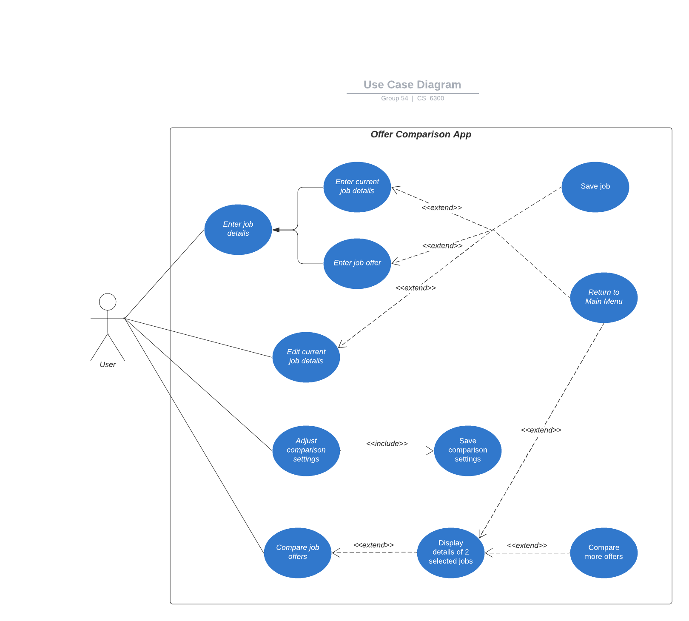

# Use Case Model

**Author**: Group 54 

## 1 Use Case Diagram

## 2 Use Case Descriptions

*Use Case: Return to Main Menu*
- *Requirements: This must allow the user to be able to view the options associated with the main menu.*
- *Pre-conditions: The user has either opened the Offer Comparison Application, cancelled or saved details relating to their current job or a new job offer, has finished performing a job comparison analysis or has updated the comparison settings.*
- *Post-conditions: The user sees the main menu screen.*
- Scenarios:
    - User views main menu at the start of the application.
    - User views main menu once current job details has been saved.
    - User views main menu once current job details has been cancelled.
    - User views main menu once current new job offer has been saved.
    - User views main menu once current new job offer has been cancelled.
    - User views main menu once comparison settings are selected.
    - User views main menu once job comparison analysis table is viewed and exited by the user.

*Use Case: Enter job details (Enter current job details or Enter new job offer)*
- *Requirements: This must allow the user to enter job details, either for their current job or a new job offer.*
- *Pre-conditions: The user is on the main menu screen and clicks the New Job Offer button.*
- *Post-conditions: The user sees a form that contains the relevant job details, along with Save and Cancel buttons.*
- Scenarios:
    - User selects job details from main menu and enters job details for current job, then saves. 
    - User selects job details from main menu and  is able to enters information for current job, then cancels. 
    - User selects job details from main menu and enters for new job offer, then saves. 
    - User selects job details from main menu and is able to enters information for new job offer, then cancels.

*Use Case: Save job*
- *Requirements: This must allow the user to save the details relating to either the current job or new job offer.*
- *Pre-conditions: The user is either on the Current Job Details or New Job Offer screens and clicks the Save button.*
- *Post-conditions: The job details relating to either the current job or new job offer are saved in the DB and the user is returned to the main menu.*
- Scenarios:
    - User saves current job once job details are entered. 
    - User saves new job offer once job details are entered.
    
*Use Case: Edit current job details*
- *Requirements: This must allow the user to update the details associated with their current job.*
- *Pre-conditions: The user has provided details relating to their current job and now clicks on the Current Job Details button on the Main Menu screen.*
- *Post-conditions: The user sees a form that contains the current information saved in the DB relating to their current job.*
- Scenarios:
    - User selects edit job details from main menu and edits current job details.
    
*Use Case: Adjust comparison settings*
- *Requirements: This must allow the user to update the weights of the comparison settings used in the job comparison analysis.*
- *Pre-conditions: The user clicks the Adjust Comparison Settings button on the Main Menu screen.*
- *Post-conditions: The user sees a form that contains the current weights of the comparison settings.*
- Scenarios:
    - User selects adjust comparsion settings from main menu and updates the comparison settings for comaprisons.
    
*Use Case: Save comparison settings*
- *Requirements: This must allow the user to save the updated weights of the comparison settings and return the user to the main menu.*
- *Pre-conditions: The user clicks the Save button on the Comparison Settings screen.*
- *Post-conditions: The comparison settings weights have been updated in the DB and the user is returned to the main menu.*
- Scenarios:
    - User selects adjust comparsion settings from main menu and selects the comparison settings for comaprisons and then save.

*Use Case: Compare job offers*
- *Requirements: This must allow the user to view a ranked list of the current job and job offers.*
- *Pre-conditions: The user clicks the Compare Job Offers button on the Main Menu screen.*
- *Post-conditions: The new job scores are calculated and the user sees a ranked list of the current job and job offers, along with the option to selected 2 of them and compare their job details.*
- Scenarios:
    - User selects compare job offers from main menu.

*Use Case: Display details of 2 selected jobs*
- *Requirements: This must allow the user to view and compare the job details associated with the 2 jobs they selected on the Compare Analysis screen.*
- *Pre-conditions: The user has selected 2 jobs on the Compare Analysis screen and has clicked the Compare Offers button.*
- *Post-conditions: The user views the job details associated with the 2 selected jobs and can either choose to compare more offers or return to the main menu.*
- Scenarios:
    -  User selects compare job offers from main menu and selects two jobs from list of job offers and views comparison.
        - User can then return to main menu.

*Use Case: Compare more job offers*
- *Requirements: This must allow the user to return back to the view containing a ranked list of the current job and job offers.*
- *Pre-conditions: The user clicks the Compare More Offers button on the Comparison Analysis screen.*
- *Post-conditions: The user sees a ranked list of the current job and job offers, along with the option to selected 2 of them and compare their job details.*
- Scenarios:
    - User selects compare job offers from main menu and selects two jobs from list of job offers and views comparison and then selects view more job comparisons.

