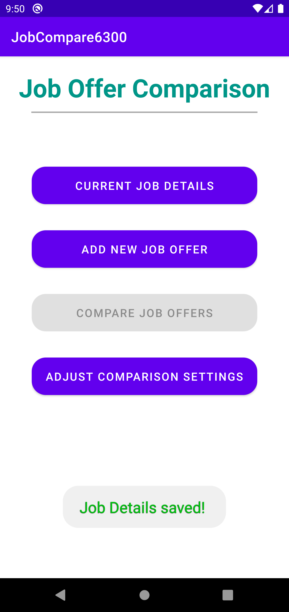

# Job Compare App 
**Author** : 6300Spring22Team054

**Version**: 2.0

## 1 Introduction
### 1.1 Overview 
**Job Compare App** is an android application created by Team054 in Spring 2022 as a project for CS6300. This application provides simple interface to save and compare between job offers. The user can get a summarised list with job ranks which provides a clear understanding of which job/offer is the best. The app also provides user the ability to assign custom weights to different factors for job comparison. 

### 1.2 Organization of the Manual
The user manual consists of the following four sections:
1. Introduction
2. System Summary
3. How to download the application
4. How to use the application

**Introduction** section provides an overview of the Job Compare application and the sections of the user manual.

**The System Summary** section outlines the hardware and software requirements for using the Job Compare App, as well as the different levels of user access.

**How to download the application** section explains the options available to download the Job Compare Android application on your mobile.

**How to use the application** section provides a detailed description of the functionalities offered by the Job Compare App.

## 2 System Summary
### 2.1 Hardware and Software Requirements
The Job Compare application can be used on a smartphone running Android operating system 10.0 (Q).

The minimum API level supported by the app is “API 29: Android 10.0 (Q)”.

In order to download the application from Google Play Store, you require an Internet connection in your smartphone.

### User Access
There is no special user role/privileges provided to any user. Anyone can use the application after download.

## 3.0 How to download the application
The Job Compare application can be downloaded using the Google Play Store.

### 3.1 Steps to download 

- By tapping on the Play Store icon on your smartphone, you can access the Google Play Store application.
- Type JobCompare on the search bar at the top of the page.
- Tap on the JobCompare application icon from the search result.
- Tap on the "INSTALL" button to install the application on your phone.

## 4 How to use the application

 

### 4.1 Main menu
 

On opening the app, the user is shown Main menu screen as shown in image below.
<figure>

</figure>

The Main menu(home screen) consists of 4 options clearly visible to get started. These menu options are the following:

- Current Job Details
- Add New job offer
- Compare Job offers
- Adjust comparison settings

The Current job details, provides the user the ability to "Enter" current job details or "Update" it if a record already exists.

Add New job Offer, gives the user the ability to add any new job offers for comparison.

Compare Job Offers provides the ability to compare multiple job offers. This option is enabled only when the user has 2 or more job offers saved already in the app data.

Adjust comparison settings, provide the user a screen where he/she can update comparison factors by assigning weights as per his/her preferance.

 
 

### 4.2 Current job details
 

On tapping, Current job details, user is navigated to the screen shown below where the current job details can be entered and saved.

If there is an existing current job record, the new screen loads with pre-filled information which can be updated.
 
On clicking "Save" user can save the new information and gets redirected to main menu. 

Tapping "Cancel" discards any changes made on the screen and sends you back to main menu.

 
 
 

 
 
 

 
 
 
 

 

### 4.3 Add New Job Offer:
 

On tapping "Add New Job Offer" button at main menu screen, the user will be navigated to the "New Job Offer" screen as shown below where the new job details can be entered and saved.

 

On clicking "Save" user can save the new information and gets redirected to main menu. 
Once Job offer is saved, user can go back to main menu and add another job offer if needed or compare job offers. 

 
 

 

When the job details are saved successfully, the user will receive a notification on screen as shown below:

 

 

Tapping "Cancel" button on this screen discards any values entered on the screen and navigates the user back to "Main menu".

 

#### 4.3.1 Validation errors while adding job/offer:
In order to save the job-details, the user is required to supply some information for the job.

These fields are :
- Title
- Company
- City
- Cost of living (cannot  be 0)
- Annual Salary (cannot be 0)

 

##### Validation error on screen
If the above fields are not supplied and the user taps on "Save" button, there will be validation errors displayed on the screen and no data will be saved in database.

On clicking on the field having red "Error" icon, more details about the error are displayed. This error hint will provide teh user with the details of the root cause of the problem. 

The error screen is shown below:
 

 

### 4.3 Compare Job Offers

 
On tapping "Compare Job Offers" button on main menu, the user will be navigated to the screen shown below where the current job details can be entered and saved.

 

The user can select two different jobs from the list of already saved jobs and tap "Compare" at the bottom to trigger the comparison process. On trying to select more than 2 jobs for comparison, the user will see a Toast message and any extra selections made will not be allowed.
This is shown in the image here:
 

 
If the user taps on the "Compare" button without selecting any jobs, another toast message is shown to remind to select 2 jobs for comparison.
 

After selecing 2 jobs the user can tap on "Compare" button. The user will be navigated to the comparison result screen where he/she can see the result in a summarized tabular format.

 

Tapping "Cancel" button on this screen discards any values selected on the screen and navigates the user back to "Main menu".

 
 
 
 

### 4.4 Compare Job Offers Results

 

Compare Job Offers result is only shown when the user makes a job comparison from "Compare Job Offers". 

The user cannot navigate to this screen without making any comparison.

This screen shows a summarized table with details like location, salary, job-benefits information if available and the rank to make user's decision making process easier.

This screen doesn't persist the comparison once made.

The user cannot access the previous comparison once leaving this screen. However, user can make a quick comparison just by tapping few buttons and get the comparison results.

The result screen is displayed on the right to provide a quick overview of what is being offered to the user. 

 
 
 

 

### 4.4 Adjust Comparison Settings

 

On tapping "Adjust Comparison Settings" button at main menu, user is navigated to the screen shown below where the comparison settings can be updated.

On clicking "Save" one can save the new comparison settings values and will be redirected to main menu. 

After saving the comaprison settings, when the user makes the comaprison between jobs/offers, the user-preferred weights are used for ranking and comparing the jobs.

Tapping "Cancel" button on this screen discards any values entered on the screen and navigates the user back to "Main menu".
